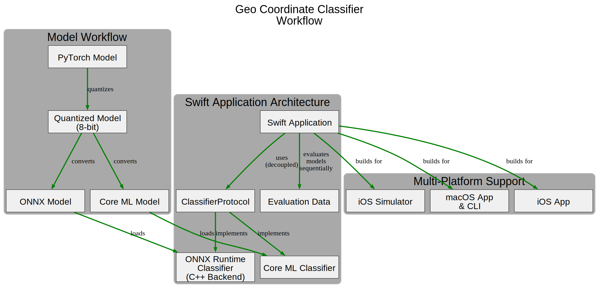
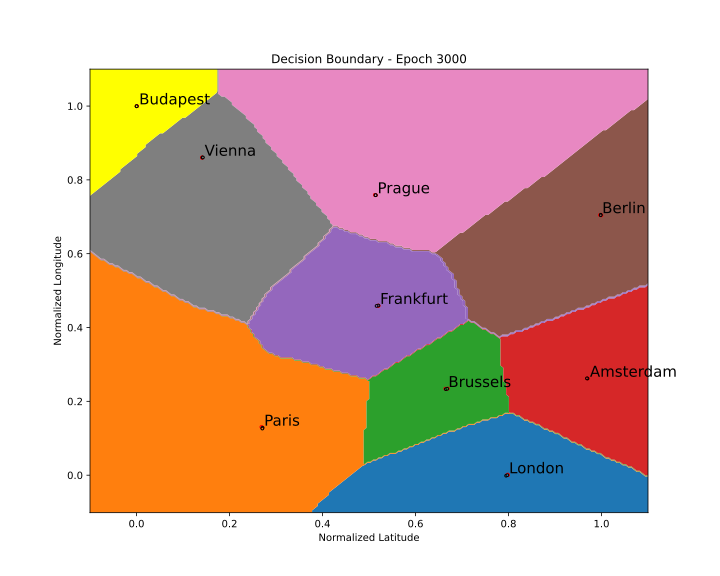
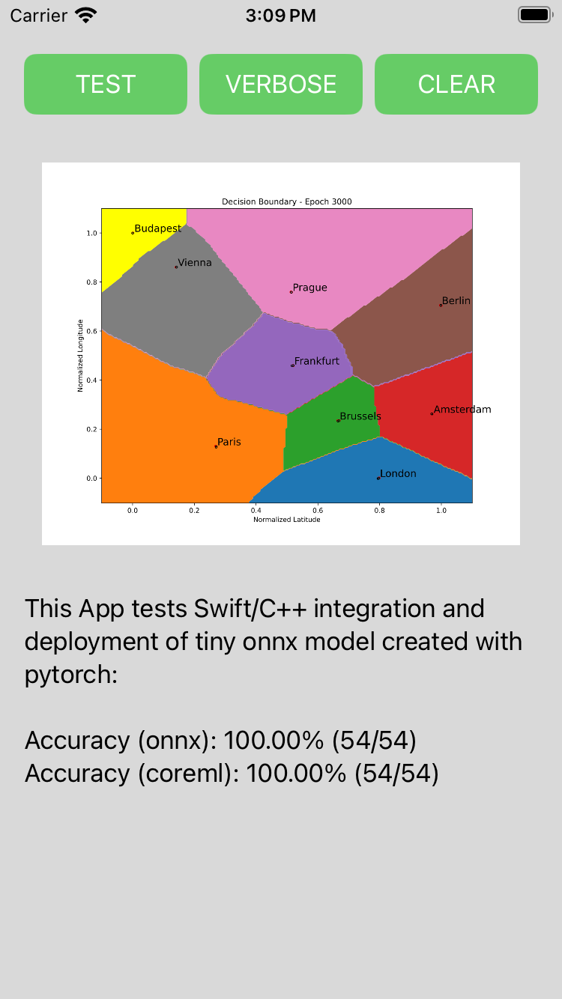

# Geo Coordinate Classifier

This project is a **Swift-based** application for classifying geographical coordinates using a C++ classifier library that runs a pre-trained **machine learning** model. Developed for multi-platform support, it demonstrates running an **ONNX** model and a **Core ML** model in a native Swift environment with a C++ backend.



-----

### Model Details

The model used by this application was initially created with **PyTorch**, **quantized** to 8-bits for efficiency, and then converted to the **ONNX** (Open Neural Network Exchange) format. The project also includes a **Core ML** version of the model, which is a native format for Apple devices. Both models now have the necessary normalization data included directly within them. This process allows the models to be deployed and run on a variety of platforms and frameworks, including **ONNX Runtime** and **Core ML**.



-----

### Features

  * **Offline inference:** Runs the ONNX and Core ML models without needing a network connection.
  * **High performance:** Utilizes the ONNX Runtime C++ API and native Core ML frameworks for efficient model execution.
  * **Portable deployment:** Validates the model's functionality in a native environment, a crucial step for target deployment scenarios.
  * **Decoupled Architecture:** Introduces **`ClassifierProtocol`** to separate the application logic from the specific classifier implementation (ONNX or Core ML). This allows for a flexible and extensible design.
  * **Automated Evaluation:** The application now evaluates both the ONNX and Core ML models on the same data, running them one after another for direct comparison.
  * **Platform Support:** Supports building as a Swift-based App for **macOS**, **iOS**, and **iOS Simulator**, and as a command-line interface (CLI) for **macOS**.

-----

### Dependencies

  * **ONNX Runtime:** The core library required for loading and running the ONNX model.
  * **Data Files:** All necessary normalization data are now embedded within the models, eliminating the need for separate data files.

-----

### Building the Project

This project supports building a Swift-based App or CLI from the command line using `xcodebuild`. The project expects the **`onnxruntime.xcframework`** directory to be located in the root directory of this project and contain the following structure:

```txt
/geo-coord-classifier
├── ...
├── geo-coord-classifier
├── geo-coord-classifier-cli
├── geo-coord-classifier.xcodeproj
├── ...
├── onnxruntime.xcframework
│   ├── Info.plist
│   ├── ios-arm64
│   │   ├── Headers
│   │   │   └── onnxruntime
│   │   └── libonnxruntime.1.23.0.dylib
│   ├── ios-arm64-simulator
│   │   ├── Headers
│   │   │   └── onnxruntime
│   │   └── libonnxruntime.1.23.0.dylib
│   └── macos-arm64
│       ├── Headers
│       │   └── onnxruntime
│       └── libonnxruntime.1.23.0.dylib
└── ...
```

#### Building from Command Line 🛠️

```bash
# Build App for macOS
make build-macosx

# Build CLI for macOS
make build-cli-macosx

# Build App for iOS Simulator
make build-ios-iphonesimulator

# Build App for iOS Device
make build-iphoneos
```

-----

### Running the Project

#### Run App (macOS) 🚀

```bash
make run-macosx
```

#### Run CLI (macOS) 🏃

```bash
make run-cli-macosx
```

#### Run App (ios-simulator)

```bash
gmake start-simulator
gmake run-app-in-ios-simulator
```

-----

<p align="center">
iOS Simulator Screenshot
<br><br>

</p>
