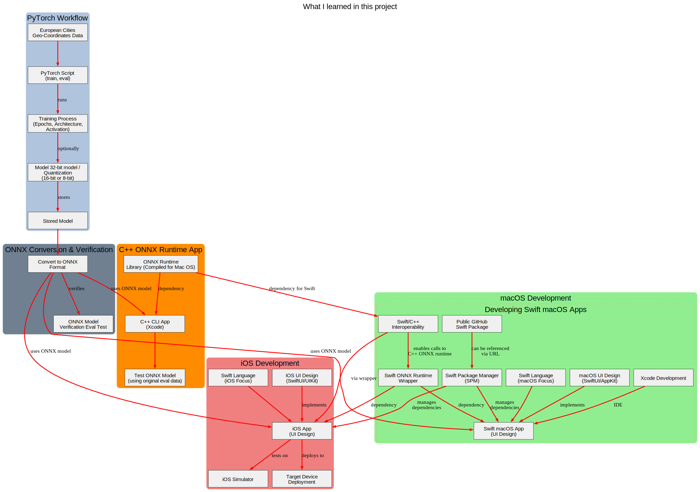

# Geo Coordinate Classifier

This project is a [Swift-based](https://en.wikipedia.org/wiki/Swift_(programming_language)) application for classifying geographical coordinates using a C++ classifier library that runs a pre-trained [machine learning](https://en.wikipedia.org/wiki/Neural_network_(machine_learning)) model. Developed for multi-platform support, it demonstrates running an [ONNX](https://en.wikipedia.org/wiki/Open_Neural_Network_Exchange) model in a native Swift environment with a C++ backend.



---

### Model Details

The model used by this application was initially created with **PyTorch**, **quantized** to 8-bits for efficiency, and then converted to the **ONNX** (Open Neural Network Exchange) format. This process allows the model to be deployed and run on a variety of platforms and frameworks, including **ONNX Runtime**.


---

### Features

* **Offline inference:** Runs the ONNX model without needing a network connection.
* **High performance:** Utilizes the ONNX Runtime C++ API for efficient model execution.
* **Portable deployment:** Validates the model's functionality in a native environment, a crucial step for target deployment scenarios.
* **Platform Support:** Supports building as a Swift-based App for **macOSX**, **iOS**, and **iOS Simulator**, and as a command-line interface (CLI) for **macOSX**.

---

### Dependencies

* **ONNX Runtime:** The core library required for loading and running the ONNX model.
* **Data Files:** This application requires data files to be present in the build directory.

**Note:** The project has a hardcoded dependency on `libonnxruntime.1.23.0.dylib`. To use a different version, you'll need to modify the Build Phase configurations.

---

### Building the Project

This project supports building a Swift-based App or CLI from the command line using `xcodebuild`. The project expects the **`onnxruntime-release`** directory to be located at the same level as your project directory and contain the following structure:

```txt
onnxruntime-release
├── iphoneos
│   ├── include
│   └── lib
├── iphonesimulator
│   ├── include
│   └── lib
└── macosx
├── bin
├── include
└── lib
````

#### Building from Command Line 🛠️

```bash
# Build App for macOSX
make build-macosx

# Build CLI for macOSX
make build-cli-macosx

# Build App for iOS Simulator
make build-ios-iphonesimulator

# Build App for iOS Device
make build-iphoneos
````

-----

### Running the Project

#### Run App (macOSX) 🚀

```bash
make run-macosx
```

#### Run CLI (macOSX) 🏃

```bash
make run-cli-macosx
```
