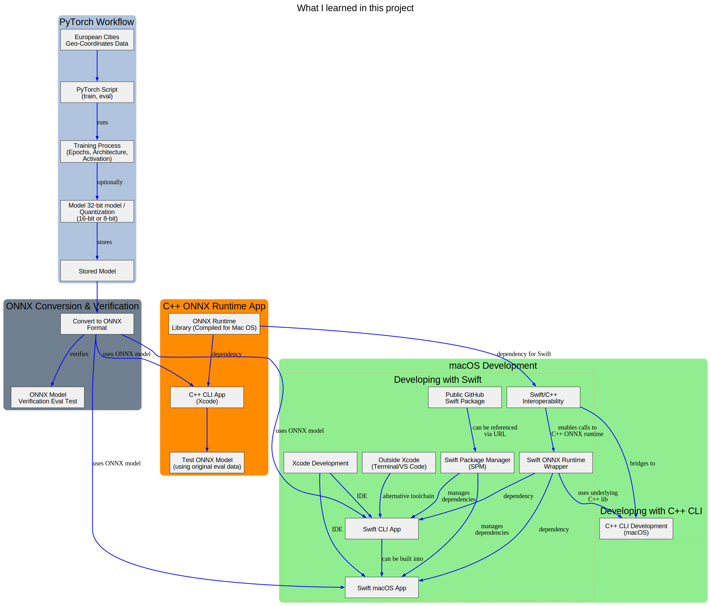

# Geo Coordinate Classifier

This project is a [Swift-based](https://en.wikipedia.org/wiki/Swift_(programming_language)) application for classifying geographical coordinates using a C++ classifier library that runs a pre-trained [machine learning](https://en.wikipedia.org/wiki/Neural_network_(machine_learning)) model. 
Developed for macOS, it demonstrates running an [ONNX](https://en.wikipedia.org/wiki/Open_Neural_Network_Exchange) model in a native Swift environment with a C++ backend.



-----

### Model Details

The model used by this application was initially created with [**PyTorch**](https://en.wikipedia.org/wiki/PyTorch), **quantized** to 8-bits for efficiency, and then converted to the **ONNX** (Open Neural Network Exchange) format. This process allows the model to be deployed and run on a variety of platforms and frameworks, including ONNX Runtime.


-----

### Features

  * **Offline inference:** Runs the ONNX model without needing a network connection.
  * **High performance:** Utilizes the ONNX Runtime C++ API for efficient model execution.
  * **Portable deployment:** Validates the model's functionality in a native environment, a crucial step for target deployment scenarios.
  * **Platform Support:** Supports building as a Swift-based App or a command-line interface (CLI).

-----

### Dependencies

  * **ONNX Runtime:** The core library required for loading and running the ONNX model.
  * **Data File:** This application requires a data file to be present in the build directory.

-----

### Building the Project

This project supports building a Swift-based App or CLI from the command line using `xcodebuild`. Ensure you have the ONNX Runtime library downloaded and the `ONNXRUNTIME_HOME` environment variable set to the root directory of your ONNX Runtime installation.

#### Building App 📲

```bash
export ONNXRUNTIME_HOME=/path/to/onnxruntime
xcodebuild -project geo-coord-classifier.xcodeproj \
    -scheme geo-coord-classifier \
    -configuration Debug \
    "ARCHS=arm64"
```

#### Building CLI 💻

```bash
export ONNXRUNTIME_HOME=/path/to/onnxruntime
xcodebuild -project geo-coord-classifier.xcodeproj \
    -scheme geo-coord-classifier-cli \
    -configuration Debug \
    "ARCHS=arm64"
```

-----

### Running the Project

#### Run App 🚀

```bash
open DerivedData/geo-coord-classifier/Build/Products/Debug/geo-coord-classifier.app
```

#### Run CLI 🏃

```bash
export ONNXRUNTIME_HOME=/path/to/onnxruntime
cd DerivedData/geo-coord-classifier/Build/Products/Debug/
./geo-coord-classifier-cli
```
