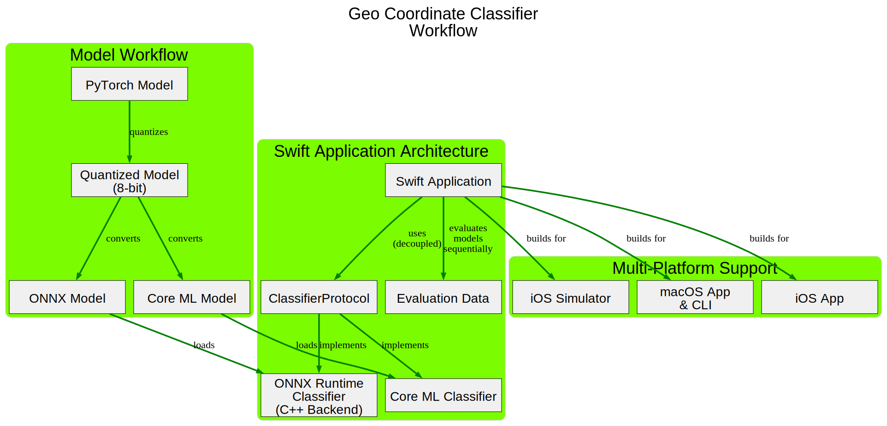

# Geo Coordinate Classifier

This project is a **[Swift](https://www.swift.org/documentation/)-based** application that demonstrates a **complete, end-to-end Machine Learning Operations (MLOps) pipeline** for deploying neural networks to Apple platforms. It showcases running both an [**ONNX**](https://onnx.ai/onnx/intro/) model (using a C++ backend) and a [**Core ML**](https://developer.apple.com/documentation/coreml) model in a native Swift environment.

The classifier's actual function—determining a region from coordinates—is a **minimal, illustrative task** used to rigorously test the complex deployment workflow, not to solve a challenging geographic problem.



-----

### Model Details

The core purpose of this project lies in the deployment process, not the complexity of the model itself.

* **Illustrative Simplicity**: The model is a **simple neural network** trained on limited data, capable of classifying the geo-coordinates of only a few specific European capitals. This controlled, trivial scenario provides a clear test case for the deployment pipeline.
* **Model Origin**: The model was initially created with [**PyTorch**](https://docs.pytorch.org/docs/stable/index.html), **quantized** to 8-bits for efficiency, and then converted to the platform-agnostic **ONNX** (Open Neural Network Exchange) format. The project also includes a native **Core ML** version.
* **Self-Contained**: Both models now have the necessary normalization data included directly within them. This process allows the models to be deployed and run on a variety of platforms and frameworks, including [**ONNX Runtime**](https://onnxruntime.ai/docs/) and **Core ML**.

<p align="center">
<b>GeoCoordClassifier Decision Boundaries (Training Visualization)</b>

</p>

-----

### Features

* **Offline inference:** Runs the ONNX and Core ML models without needing a network connection.
* **High performance:** Utilizes the ONNX Runtime C++ API and native Core ML frameworks for efficient model execution.
* **Portable deployment:** Validates the model's functionality in a native environment, a crucial step for target deployment scenarios.
* **Decoupled Architecture:** Introduces **`ClassifierProtocol`** to separate the application logic from the specific classifier implementation (ONNX or Core ML). This allows for a flexible and extensible design.
* **Automated Evaluation:** The application now evaluates both the ONNX and Core ML models on the same data, running them one after another for direct comparison.
* **Platform Support:** Supports building as a Swift-based App for **macOS**, **iOS**, and **iOS Simulator**, and as a command-line interface (CLI) for **macOS**.

-----

### Dependencies

* **ONNX Runtime:** The core library required for loading and running the ONNX model.
    * This project requires the **`onnxruntime.xcframework`** directory to be manually created and populated with header files and shared libraries (e.g., `libonnxruntime.1.23.0.dylib`) for **all platforms subject to build** (macOS, iOS, and iOS Simulator), as detailed in the [Building the Project](#building-the-project) section.
* **Model Files:**
    * `GeoClassifier.onnx`: The ONNX format of the quantized model.
    * `GeoClassifier.mlpackage`: The Core ML format of the model.
* **Evaluation Data:**
    * `GeoClassifierEvaluationData.json`: The data file used by the application to run automated, sequential evaluation on both the ONNX and Core ML backends.

-----

### Building the Project

<p align="center">
Xcode Project Build Dependency Graph
<br><br>

</p>

This project supports building a Swift-based App or CLI from the command line using `xcodebuild`. The project expects the **`onnxruntime.xcframework`** directory to be located in the root directory of this project and contain the following structure:

```txt
/geo-coord-classifier
├── ...
├── geo-coord-classifier
├── geo-coord-classifier-cli
├── geo-coord-classifier.xcodeproj
├── ...
├── onnxruntime.xcframework
│   ├── Info.plist
│   ├── ios-arm64
│   │   ├── Headers
│   │   │   └── onnxruntime
│   │   └── libonnxruntime.1.23.0.dylib
│   ├── ios-arm64-simulator
│   │   ├── Headers
│   │   │   └── onnxruntime
│   │   └── libonnxruntime.1.23.0.dylib
│   └── macos-arm64
│       ├── Headers
│       │   └── onnxruntime
│       └── libonnxruntime.1.23.0.dylib
└── ...
```
#### Building from Command Line 🛠️

```bash
# Build App for macOS
make build-macosx

# Build CLI for macOS
make build-cli-macosx

# Build App for iOS Simulator
make build-ios-iphonesimulator

# Build App for iOS Device
make build-iphoneos
```

-----

### Running the Project

#### Run App (macOS) 🚀

```bash
make run-macosx
```

#### Run CLI (macOS) 🏃

```bash
make run-cli-macosx
```

#### Run App (ios-simulator)

```bash
gmake start-simulator
gmake run-app-in-ios-simulator
```

-----

<p align="center">
iOS Simulator Screenshot
<br><br>

</p>
